# 目录

[Button项目 [1](#_Toc196580847)](#_Toc196580847)

[1 任务 [1](#任务)](#任务)

[2 开始任务 [2](#开始任务)](#开始任务)

[2.1 按键 [2](#按键)](#按键)

[2.2 灯 [2](#灯)](#灯)

[3 按键上拉电阻 [3](#按键上拉电阻)](#按键上拉电阻)

[4 配置完毕，看keil（按着亮，松开灭） [4](#配置完毕看keil按着亮松开灭)](#配置完毕看keil按着亮松开灭)

[4.1 设置与编译 [4](#设置与编译)](#设置与编译)

[4.2 代码部分 [4](#代码部分)](#代码部分)

[4.3 代码 [5](#代码)](#代码)

[5 改进，按一下就亮，按一下就灭 [5](#改进按一下就亮按一下就灭)](#改进按一下就亮按一下就灭)

[6 消除抖动 [5](#消除抖动)](#消除抖动)

[7 中断+按键 [6](#中断按键)](#中断按键)

[7.1 代码部分 [6](#代码部分-1)](#代码部分-1)

[7.2 优势 [7](#优势)](#优势)

[7.3 双按键 [8](#双按键)](#双按键)

------------------------------------------------------------------------

注意：双按键项目文件为2buttons

------------------------------------------------------------------------

# 任务

按键改变灯的亮灭（课程只给一个按键，两个按键自己想，不考虑同时按下，一次只按下一个）

# 开始任务

## 按键

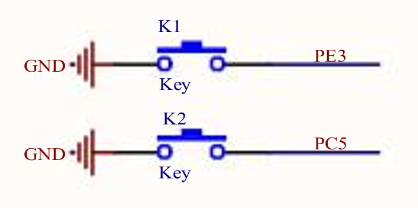

使用PE3

为什么input？

GPIO（​**​General-Purpose Input/Output​**​，通用输入输出）是嵌入式系统和微控制器中常见的硬件接口，用于与外部设备进行数字信号交互。

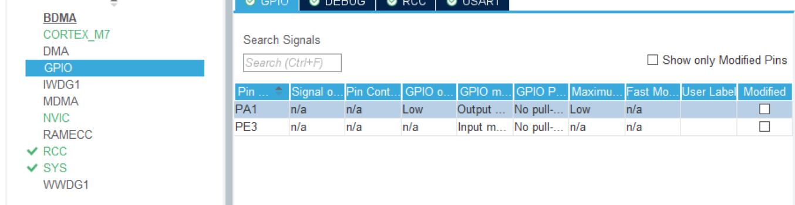

这里看到设置为GPIO的具体引脚，作具体配置

## 灯

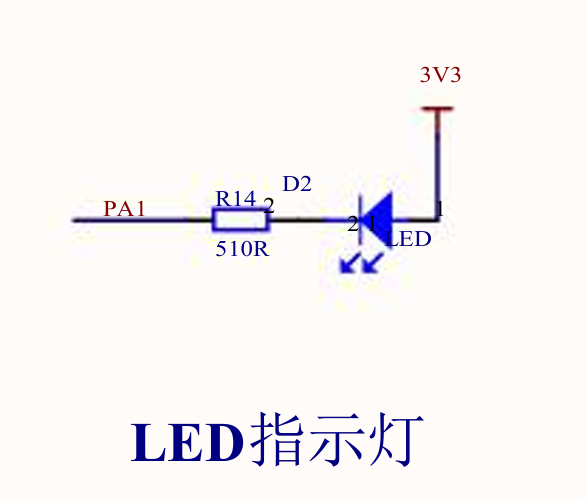灯是PA1，低电平点亮

Output

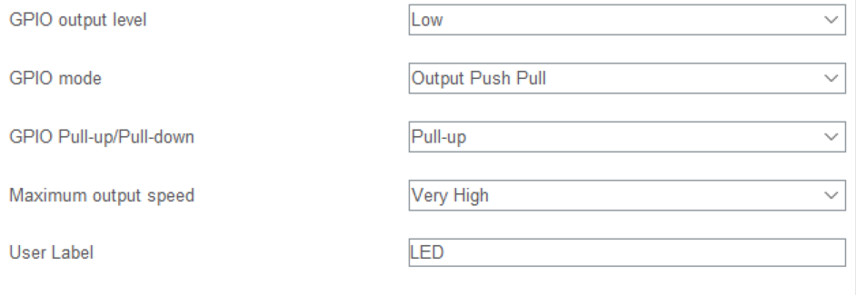

# 按键上拉电阻

H743没有上拉电阻，自己加？怎么加？

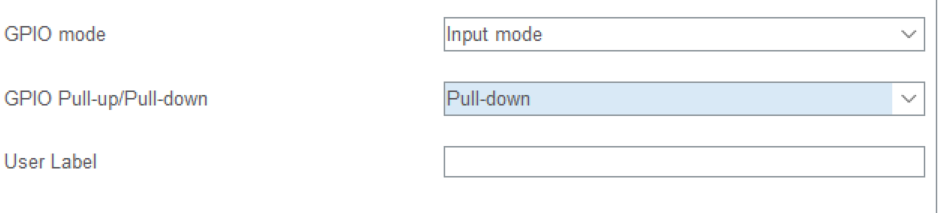

配置为pullup

配置为上拉电阻

按下，低电平，导通到GND

松开，高电平，被上拉高

配置为下拉，始终为低电平

# 配置完毕，看keil（按着亮，松开灭）

## 设置与编译

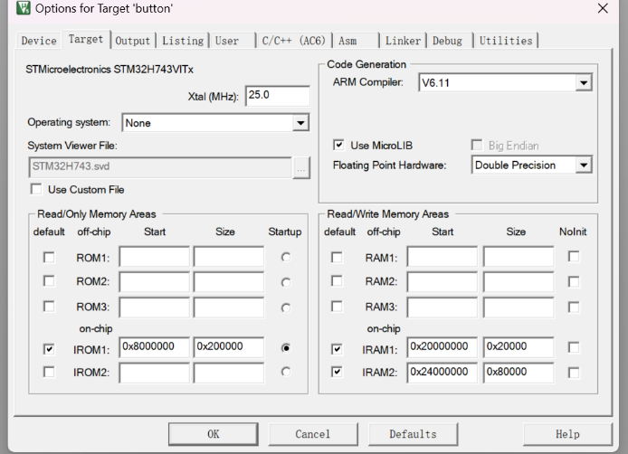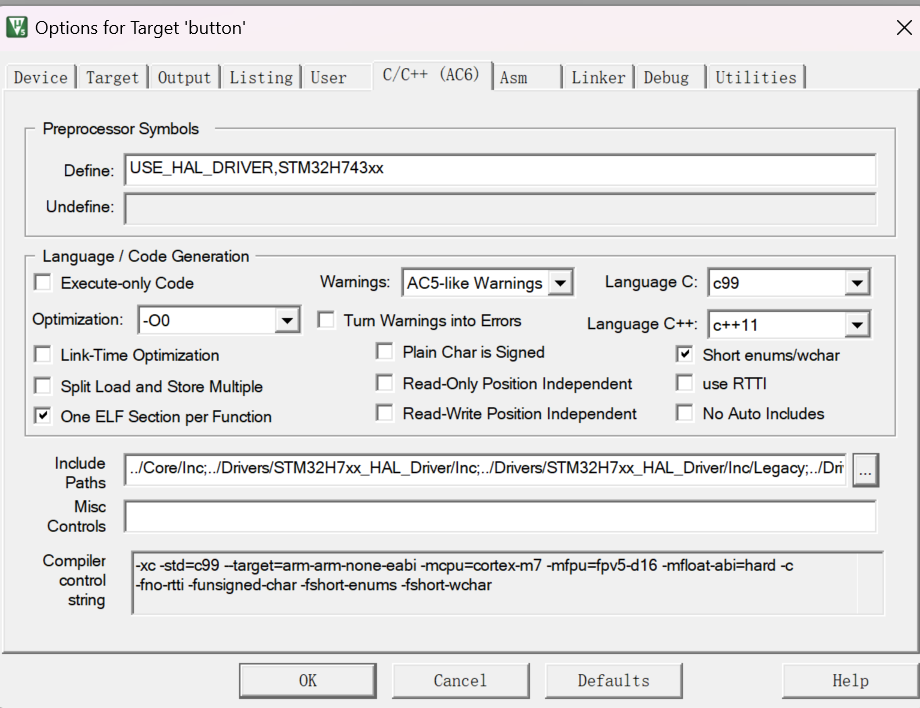

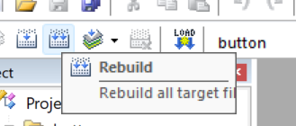编译一下

## 代码部分

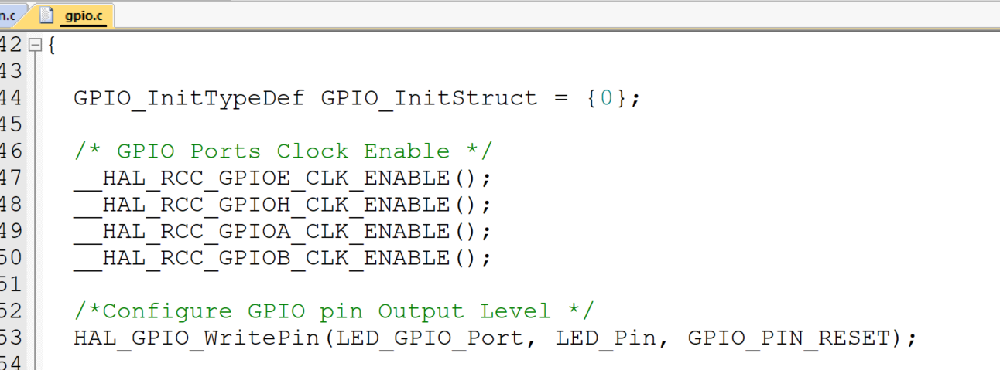

这个文件，配置

`/\*Configure GPIO pin Output Level \*/输出电平`

`HAL_GPIO_WritePin(LED_GPIO_Port, LED_Pin, GPIO_PIN_RESET);`

`/\*Configure GPIO pin : PtPin \*/`

`GPIO_InitStruct.Pin = KEY_Pin;`

`GPIO_InitStruct.Mode = GPIO_MODE_INPUT;`

`GPIO_InitStruct.Pull = GPIO_PULLUP;`

`HAL_GPIO_Init(KEY_GPIO_Port, &GPIO_InitStruct);`

`/\*Configure GPIO pin : PtPin \*/`

`GPIO_InitStruct.Pin = LED_Pin;`

`GPIO_InitStruct.Mode = GPIO_MODE_OUTPUT_PP;`

`GPIO_InitStruct.Pull = GPIO_PULLUP;`

`GPIO_InitStruct.Speed = GPIO_SPEED_FREQ_VERY_HIGH;`

`HAL_GPIO_Init(LED_GPIO_Port, &GPIO_InitStruct);`

KEY,LED都

## 代码

`/\* USER CODE BEGIN WHILE \*/`

`uint32_t key_value=0;`

`key_value=HAL_GPIO_ReadPin(KEY_GPIO_Port,KEY_Pin);`

`HAL_GPIO_WritePin(LED_GPIO_Port,LED_Pin,key_value);`

`while (1)`

`{`

`key_value=HAL_GPIO_ReadPin(KEY_GPIO_Port,KEY_Pin);`

`HAL_GPIO_WritePin(LED_GPIO_Port,LED_Pin,key_value);`

`Delay_Ms(50);`

`/\* USER CODE END WHILE \*/`

`/\* USER CODE BEGIN 3 \*/`

`}`

`/\* USER CODE END 3 \*/`

`}`

# 改进，按一下就亮，按一下就灭

轮询方式

# 消除抖动

软件消抖

加延时

阻塞循环？

# 中断+按键

所谓中断，就是按键（上升沿或者下降沿）触发中断，执行需要的任务。

设置为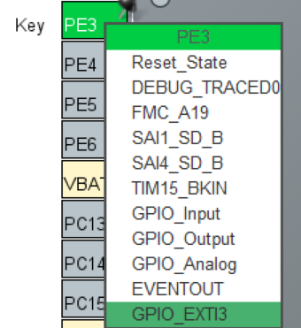EXTI

中断

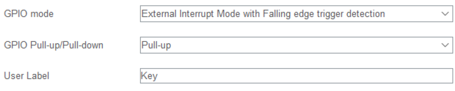

Mode选择为下降沿

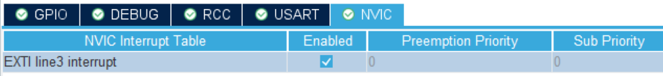

打开中断NVIC

或者这个地方（优先级可以调，多数为并列）

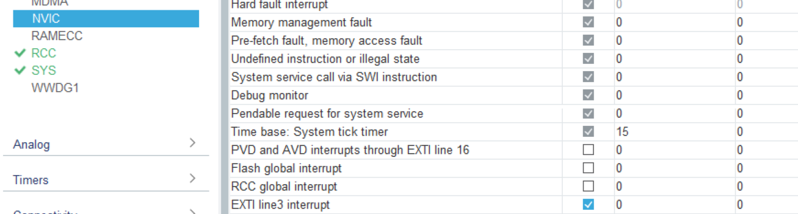

## 代码部分

额外关注这个文件：管理所有中断服务的程序代码

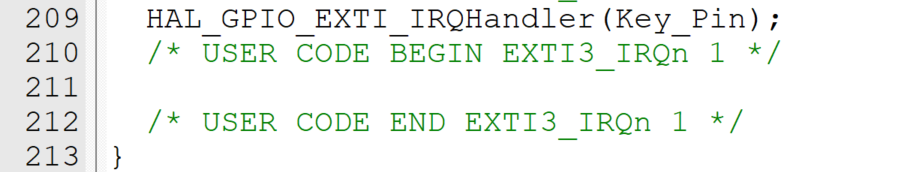

这里写，中断时去做什么事

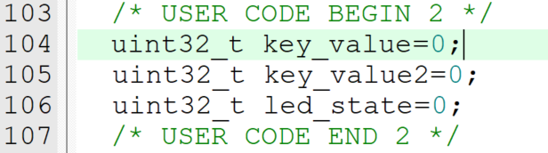这里是main函数？

这里在main.c定义了三个变量，如何在中断文件里引用这三个变量？

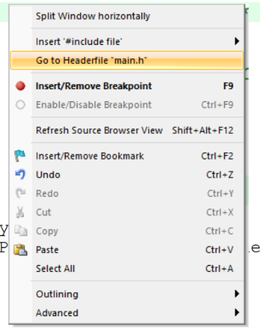去头文件headerfile

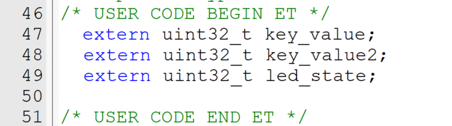

相当于声明全局变量？

在main.c里面这三个变量不要放在main函数里，放在外面

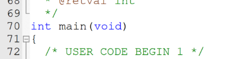

可以看的小小的mian函数隐匿在了庞大的/\*里面

可爱么么哒

放在外面，具体是这里

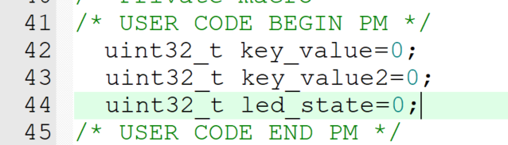

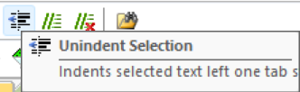挪一下

再改一下代码

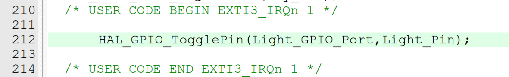

完成！

## 优势

稳定，敏感，所以按键推荐用中断方式。

## 双按键

将两个按键都在cube里面配置好后，发现中断文件里面多了一个函数

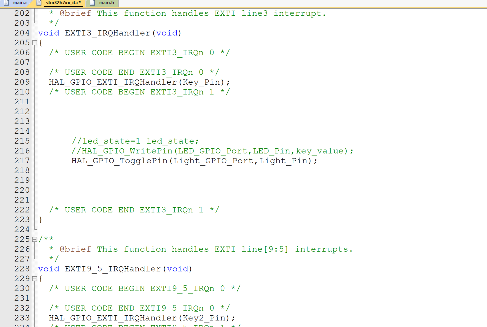

两个就是对应两个按键

触发条件后执行函数里面的内容

